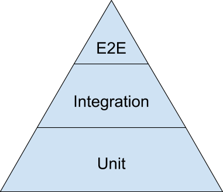

# Practicing DRY in react (with Typescript)

## Component Strategies

- use or create a component library
   - [mui](./package.json#L21) package
   - [mui library](https://mui.com/material-ui/getting-started/)
   - [material design](https://m2.material.io/)
      - if you pick a component library you are either choosing to follow the decisions they have made (e.g. following a specific style guide) or fighting the those decisions repeatedly
   - example of [using a component](./src/ShoppingCart/AddToCartButton.tsx#L17) in `<AddToCartButton />`
- compose smaller components into larger ones
   - e.g. [`<ProductTile />`](./src/HomePage/ProductTile.tsx)
- "reverse" compose components with children props or "slotted children"
  - e.g. children: [`<Layout />`](./src/Layout.tsx#L10)
  - e.g. slots:
     - [`<ProductTile />`](./src/HomePage/ProductTile.tsx#L15) provides slotted children
     - [`<ProductCard />`](./src/Product/ProductCard.tsx#L37) renders slotted children
- follow [Single Responsibility Principle](https://en.wikipedia.org/wiki/Single-responsibility_principle) to make it easier to collect functionality of the same type into one place rather than repeat it multiple places
  - example: [`<App />`](./src/App.tsx#L34) ties together the components from different contexts and Dependency Inverts routing and location so that none of the display components have to know anything about the routing implementation

## Styling

- use or create an application theme
   - avoid one-off styling, just follow the theme
      - not following the theme is a UI design smell
   - example: [app theme](./src/app.theme.ts) styles [icon buttons](./src/ShoppingCart/AddToCartButton.tsx)
- use the 12 column grid to keep content aligned, in place, and responsive
   - e.g. [`<HomePage />`](./src/HomePage/HomePage.tsx#L14)

## Functional

- create reusable functions for discrete functionality
   - e.g. [convert product internal type from api contract](./src/Entities/productFromContract.ts)
- make these functions into hooks if that functionality is react-specific
   - e.g. [useGetProducts](./src/Entities/useGetProducts.ts)
- advanced: use currying / partial application to make your functions or hooks even more reusable
   - e.g. [useUpdateProduct](./src/Entities/useUpdateProduct.ts) takes a `Product` parameter and returns another function which [useAddProductReview](./src/Entities/useAddProductReview.ts) uses to produce more specific functionality

## Testing

- use the same design patterns you might use in "production" code in your test code; code is code
   - e.g. [product factory method](./src/test/productFactory.ts) to produce product data shapes when the actual data doesn't really matter
- leverage test function heirarchies and shared setups
   - e.g. [setup shared data at the global scope](./src/Entities/productFromContract.test.ts#L9) then [shared test setup](./src/Entities/productFromContract.test.ts#L15) within the test scope (could be repeated to deeper depth within nested `describe` blocks)
- use the testing pyramid to keep good coverage of your code without needing to repeat test scenarios in your higher order tests

   - [E2E](../DryDryDessert.EndToEndTest/src/app.spec.ts) can be few because there are plenty of more focused unit tests closer to the units

## Typing / Typescript

- let typescript infer types for you
   - e.g. [`<HomePage />`](./src/HomePage/HomePage.tsx#L11) `const products = useGetProducts();` is equivalent to `const products: Product[] = useGetProducts();` but typescript already knows, from the signature of `useGetProducts` what type `const products` is
   - e.g. [`useLoadProductImage`](./src/Entities/useLoadProductProperty.ts#L17) infers that the return type is `URL | undefined` from the generic constraints of [`useLoadProductProperty`](./src/Entities/useLoadProductProperty.ts#L4)
- use typeguards to check types then let typescript's type-narrowing help you avoid needing to check a type again
   - example: [shoppingCartSlice](./src/ShoppingCart/shoppingCart.slice.ts#L37):37 narrows the type so that from [shoppingCartSlice](./src/ShoppingCart/shoppingCart.slice.ts#L40):40 onward the type checker lets us know that the type is known to `ProductSelection`, no need to check again
      - the narrowed type can then be further passed to other functions that also don't need to check types or check objects to ensure the properties they count on an object having are there
- define and import types to avoid repeating them
   - e.g. [`Product`](./src/Entities/Product.ts)
   - e.g. [`navigateToProductDetails`](./src/App.tsx#L11)
- leverage computed types to avoid repeating type definitions
   - e.g. [only the required parts](./src/HomePage/ProductTile.tsx#L7) of a `Product` are in the component API contract
   - e.g. [properties based on the keys of another type](./src/ShoppingCart/shoppingCart.slice.ts#L8)
- leverage union and intersection types to avoid repeating type definitions
   - e.g. [shopping cart slice](./src/ShoppingCart/shoppingCart.slice.ts#L18) adds a property (`selectedQuantity`) to `Product` for internal use in the slice without rewriting `Product`
- use generic functions
   - e.g. generic [`clientFactory`](./src/clients/index.ts#L4) for both kinds of clients

## Design / Architecture

- map external types to a shared internal type before letting external data into your code
   - similar to [Hexagonal Architecture](https://en.wikipedia.org/wiki/Hexagonal_architecture_(software)) (a.k.a. Ports and Adapters)
   - e.g. [`productFromContract`](./src/Entities/productFromContract.ts)
- use code generators for code that would otherwise be an excerise in toil... if appropriate
   - e.g. [open api generated API clients](./src/clients)
- use [react context](https://react.dev/learn/scaling-up-with-reducer-and-context) to avoid prop drilling and contextual state management... if appropriate
   - e.g. [Product](./src/Product/)
      - [`ProductContext`](./src/Product/ProductContext.ts)
      - [provide the context](./src/Product/ProductDetails.tsx#L13)
      - [use the context](./src/Product/ProductTile.tsx#L31)
- use [redux (redux toolkit)](https://redux-toolkit.js.org/) to avoid prop drilling and manage global application state / state across contexts... if appropriate
   - e.g. [shopping cart](./src/ShoppingCart/)
      - [define the state slice](./src/ShoppingCart/shoppingCart.slice.ts#L62)
      - [add to app global state](./src/app.store.ts#L6)
      - [provide the context to components](./src/App.tsx#L67)
      - [make changes to state](./src/ShoppingCart/AddToCartButton.tsx#L17)
      - [consume current state](./src/ShoppingCart/ShoppingCart.tsx#L36)

## Times **not** to chase DRY

there will be times when things *just happen* to seem similar and repetitive but, really, they're different... unfortunately kind of a gut feel thing

if you're already following other good coding foundational practices it won't be too painful to get this wrong, in either direction; your code will be flexible enough to avoid it hurting to go one way and then back out of it

a few examples:
- procedural code: trying to reduce duplication in procedural code is how it turns into spaghetti almost every time.  Just let there be duplication or graduate it to Object Oriented or Functional instead.
- commonly tests are better off being allowed to repeat code to allow there to be subtle differences

## Try it Yourself

[product search](./src/ProductSearch/ProductSearch.tsx) has been intentionally left unimplemented to give you a place to play.  The search Bar on the other pages does nothing other than bring you to the search results "page".

Or play around with changing whatever!